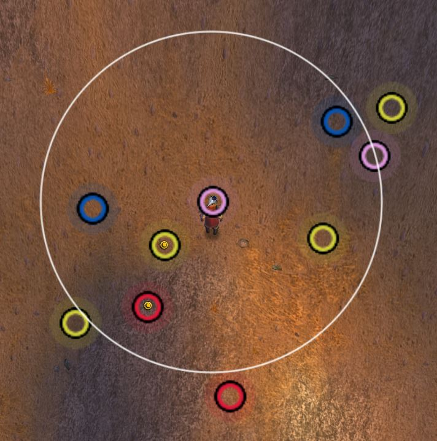

# FarmHud

Based on [farmhud](https://github.com/HizurosWoWAddOns/FarmHud)

## Usage

Use with [pfquest](https://github.com/shagu/pfQuest/)

`/db herbs`

`/farmhud`

## Screenshot

## Notes

White circle indicates the range where the blizzard yellow blips/nodes will show.

You may have to mouse over the middle to get the pfquest nodes to show.

You can't mouse over the yellow blips/nodes because it disables mouse interaction. This is a trade off because if we enabled mouse interaction you wouldnt be able to click through and you would just ping the minimap.

Consider also using: https://github.com/seacrabsam/patch-herb
